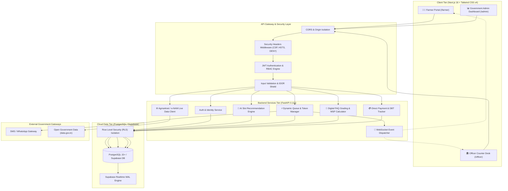
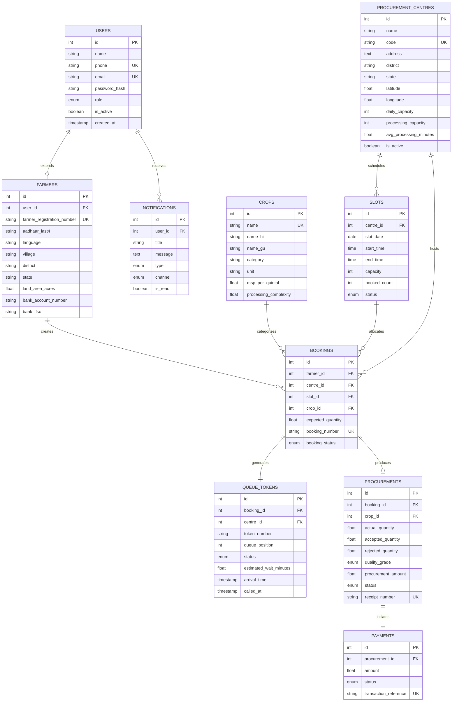
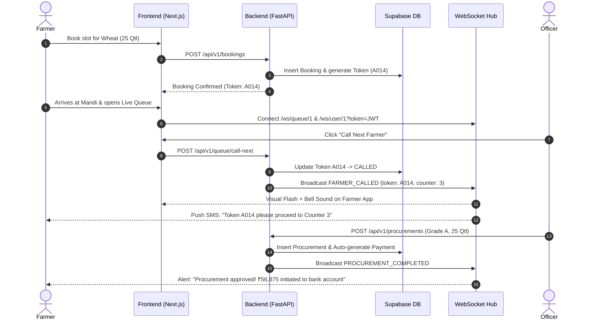

# KisanSetu AI — Architecture & Technical Design Document

**Project**: KisanSetu AI (किसान सेतु)  
**Problem Statement ID**: 26032 | Smart Automation  
**Ministry**: Ministry of Consumer Affairs, Food & Public Distribution  
**Department**: Department of Consumer Affairs (DoCA)  

---

## 1. System Architecture Overview

KisanSetu AI is engineered as an enterprise, event-driven, full-stack platform consisting of a high-performance Next.js 16 frontend, an asynchronous FastAPI backend, a real-time WebSocket broker, and a PostgreSQL / Supabase cloud data layer.

---

## 2. Component Hierarchy & C4 Container Model

| Container | Technology Stack | Key Responsibilities |
|---|---|---|
| **Frontend Web App** | Next.js 16.3 (Turbopack), React 19, Tailwind CSS v4, Lucide Icons | Responsive multilingual portal for Farmers, Officers, and Admins; real-time queue tracker; slot booking wizard. |
| **Backend REST API** | FastAPI 0.115, Python 3.13, Pydantic v2, SQLAlchemy 2.0 Async | Business logic, JWT authentication, slot scheduling, IDOR protection, and metrics aggregation. |
| **Smart Recommendation Engine** | Pure Python Algorithmic Engine (NumPy/Math) | 3-factor congestion analysis, wait-time prediction, multi-mandi load balancing. |
| **Real-Time WebSocket Hub** | Starlette WebSockets & Supabase Realtime | Zero-polling instantaneous queue updates, counter call rings, and SMS dispatch alerts. |
| **Database & Persistence** | PostgreSQL 15+ / Supabase Cloud with RLS | Relational storage for 11 core entities, foreign key constraints, automated WAL replication. |

---

## 3. Database Entity Relationship Model (ERD)

---

## 4. 🤖 AI Recommendation Engine Formula

The AI Slot Recommendation Engine prevents mandi gridlock by distributing farmer arrivals across low-congestion timeslots and nearby centres:

### Formula 1: Predicted Wait Time (\(\hat{W}\))
$$\hat{W} = \frac{Q \times T_{avg} \times C_{crop}}{N_{counters}}$$

* \(Q\): Number of farmers currently waiting ahead in the physical queue.
* \(T_{avg}\): Average handling time for the centre (default: 15–20 minutes).
* \(C_{crop}\): Commodity grading complexity factor (e.g., Wheat = 1.0, Mustard = 1.2, Cotton = 1.4).
* \(N_{counters}\): Active processing counters operating at the mandi.

### Formula 2: Centre Congestion Index (\(CI \in [0, 100]\))
$$CI = \min\left(100,\; 40 \times \frac{B}{Cap_{slot}} + 40 \times \frac{Q}{Cap_{daily}} + 20 \times \frac{\hat{W}}{60}\right)$$

* \(B / Cap_{slot}\): Slot booking occupancy ratio.
* \(Q / Cap_{daily}\): Daily procurement target throughput ratio.
* \(\hat{W} / 60\): Expected waiting hour pressure.

### Formula 3: Slot Optimization Score (\(S_{slot}\))
$$S_{slot} = 0.5 \times \left(\frac{B}{Cap}\right) + 0.3 \times \min\left(1, \frac{\hat{W}}{120}\right) + 0.2 \times \left(\frac{CI}{100}\right)$$

Slots are sorted in ascending order of \(S_{slot}\). The top 3 optimal slots are tagged with human-readable recommendations (e.g., *"⚡ Fastest processing with low queue"*).

---

## 5. Real-Time Event Driven Lifecycle

